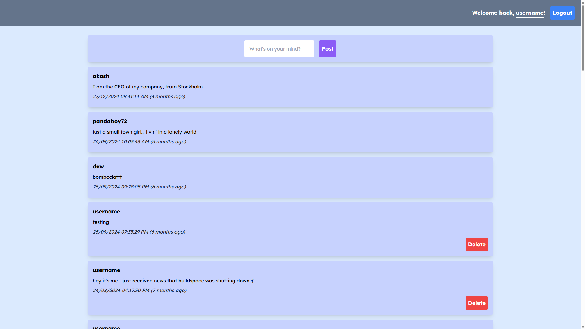

# LinkedOut
A bare-bones social media website created using React to render the front-end view and an Express server connected to a MongoDB instance to handle read/writes to the database. This project features [Jamstack](https://jamstack.org/) 
architecture with the front-end built and deployed to GitHub Pages and the server hosted separately on Railway.

## Core Features
- Persistent user sessions with JSON Web Token validation. After successful authentication, a cookie is stored on the client which verifies that subsequent requests authorized.
- Encrypted password hashes stored on NoSQL database
- Read and write posts through HTTP GET and POST requests to the backend
- Delete posts if the post belongs to the user

## Post Structure
| Name        | Data Type   | Description |
| ----------- | ----------- | ----------- |
| `id`        | ObjectId    | [MongoDB data type](https://www.mongodb.com/docs/manual/reference/method/ObjectId/) |
| `name`   | String        | Username of the poster |
| `text`   | String        | Post text |

## User Structure
| Name        | Data Type   | Description |
| ----------- | ----------- | ----------- |
| `username`  | String      |             |
| `hash`      | String      | password encrypted with bcrypt |

## Client Setup
1. Navigate to the `client` directory
2. `npm install` to install dependencies
4. `npm run start` to start the React app

## Server Setup
1. Navigate to the `server` directory
2. Create a `.env.` file with the following fields
```
MONGODB_URI={MONGODB_URI} // connection string for connecting to MongoDB cloud instance
DB_NAME={DB_NAME}         // name of your MongoDB subdirectory
PORT={PORT}               // port server is to be hosted at
JWT_SECRET_KEY={JWT_KEY}  // JSON Web Token key used for verifying user requests
ALLOWED_ORIGIN            // only requests from this origin are allowed, for example: `http://localhost:3000` to only accept requests locally
```
3. `npm install` to install dependencies
4. `npm run start` to run the development server.

## Live Preview
Check it out live [here!](https://raymozou.github.io/linked-out/)
- Please be patient as the app is currently hosted on Render's free tier plan which has an abnormally long wind up time. Thanks!

## Preview
### Login/Signup Page

### Homepage


## What's Next?
- Sort posts by name, date & more
- Edit existing posts
- Move rendering to server side with Next.js?
- Move server endpoints to `/api` route and serve static client files from `/`
